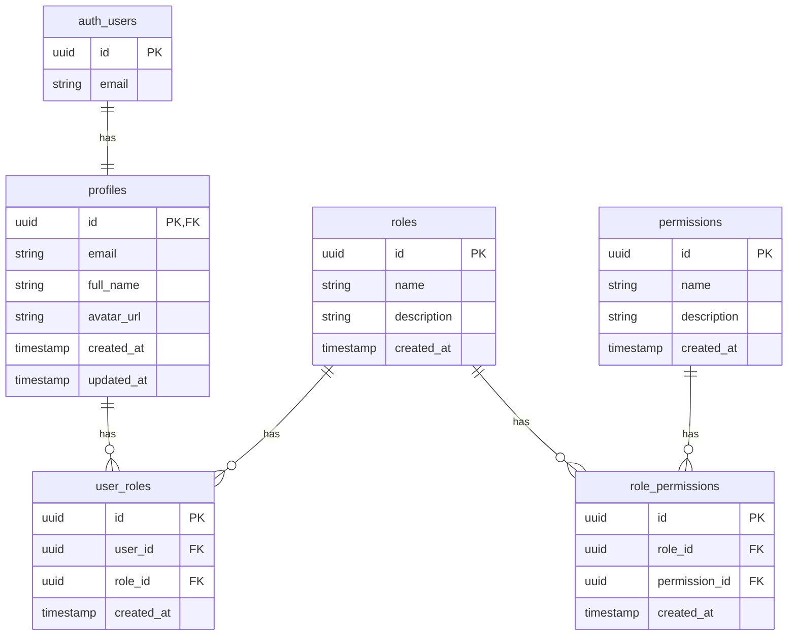

# データベース設計ドキュメント

## 概要
このドキュメントでは、ポートフォリオサイトで使用するデータベースの設計について説明します。

## テーブル一覧

| テーブル名 | 説明 | ドキュメント |
|------------|------|--------------|
| profiles | ユーザープロフィール情報 | [profiles.md](./profiles.md) |
| roles | システムロール定義 | [roles.md](./roles.md) |
| permissions | システム権限定義 | [permissions.md](./permissions.md) |
| user_roles | ユーザーとロールの関連 | [user_roles.md](./user_roles.md) |
| role_permissions | ロールと権限の関連 | [role_permissions.md](./role_permissions.md) |

## ER図



## セキュリティ設計

### RLSポリシー
各テーブルにRow Level Security (RLS)ポリシーを適用し、以下の原則に従ってアクセス制御を行います：

1. 認証済みユーザーのみがデータにアクセス可能
2. 管理者のみが管理系の操作が可能
3. ユーザーは自身のデータのみ更新可能

### 権限システム

1. ロールベースのアクセス制御（RBAC）
- 管理者（admin）
- クライアント（client）
- 一般ユーザー（user）

2. 細かな権限制御
- manage_users: ユーザー管理
- manage_roles: ロール管理
- manage_content: コンテンツ管理
- view_admin_dashboard: 管理画面閲覧
- manage_client_projects: クライアントプロジェクト管理
- view_client_dashboard: クライアントダッシュボード閲覧

## 初期データ

各テーブルの初期データは、それぞれのテーブルドキュメントを参照してください。
初期データの投入は、マイグレーション時に実行されます。

## バックアップ戦略

1. 自動バックアップ
- Supabaseの自動バックアップ機能を使用
- 毎日バックアップを実行
- バックアップの保持期間は30日

2. 手動バックアップ
- 重要な更新前には手動でバックアップを実行
- `supabase db dump` コマンドを使用

## マイグレーション管理

1. マイグレーションファイル
- `supabase/migrations` ディレクトリで管理
- タイムスタンプ付きのSQLファイルで管理

2. マイグレーションの実行
```bash
supabase db reset # 開発環境での完全リセット
supabase migration up # 本番環境での適用
``` 