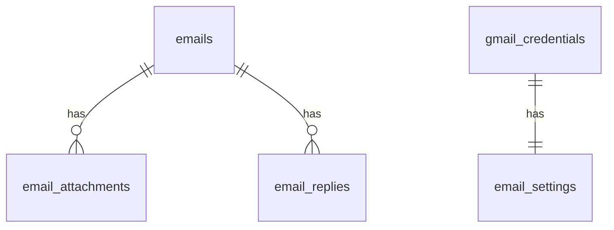

# Gmail連携機能 データベース設計

## 概要
ポートフォリオサイトの管理者機能として、Gmailと連携してメールの表示・返信を行うための機能を実現するためのデータベース設計です。

## テーブル一覧
- [emails](./emails.md) - メール本体の情報を管理するテーブル
- [email_attachments](./email_attachments.md) - メールの添付ファイルを管理するテーブル
- [email_replies](./email_replies.md) - 送信したメールの返信情報を管理するテーブル
- [gmail_credentials](./gmail_credentials.md) - Gmail APIの認証情報を管理するテーブル
- [email_settings](./email_settings.md) - メール関連の設定を管理するテーブル

## テーブル間の関連

## セキュリティ
- 各テーブルにはRow Level Security (RLS)が適用されています
- 認証済みユーザーのみがアクセス可能
- Gmail APIの認証情報は暗号化して保存

## 拡張性
このデータベース設計は以下の機能追加に対応できるように設計されています：
- メールのフィルタリングルール機能
- メールテンプレート機能
- メール分析機能
- 複数のGmailアカウント対応

## 注意事項
- Gmail APIの利用制限に注意が必要
- 大量のメールデータの同期処理の最適化が必要
- 添付ファイルはSupabase Storageに保存
- アクセストークンの定期的な更新処理の実装が必要 