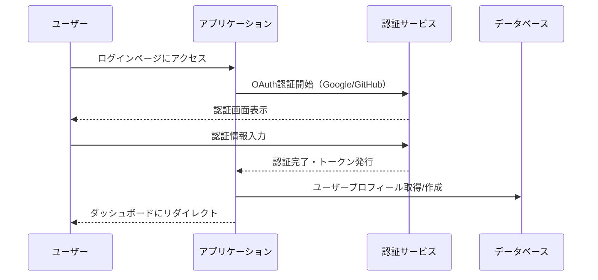
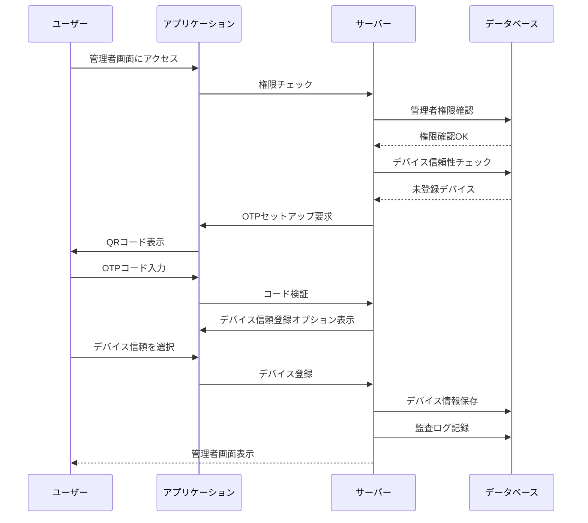
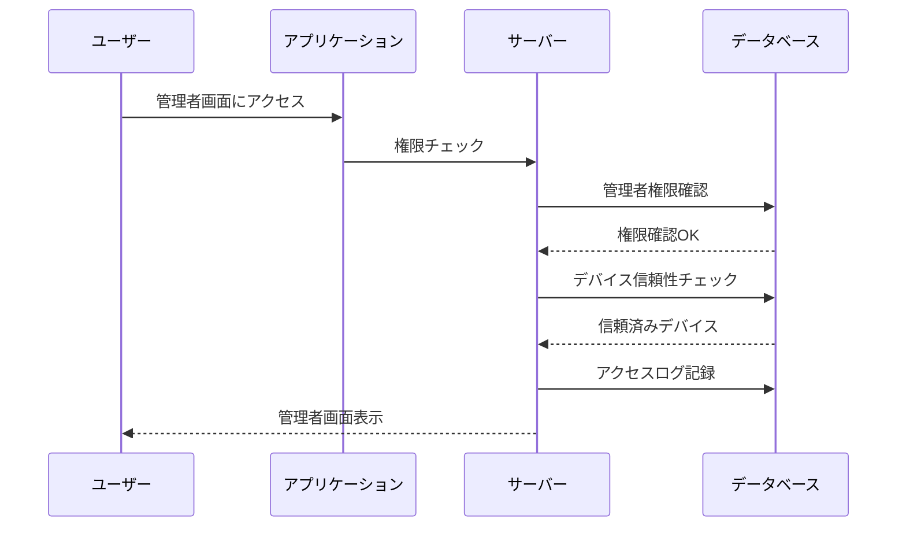

# 認証フロードキュメント

## 1. 通常のログインフロー

## 2. 管理者画面アクセスフロー

### 2.1 初回アクセス時（未登録デバイス）

### 2.2 信頼済みデバイスからのアクセス

## 3. デバイス管理フロー

### 3.1 デバイスの信頼登録

1. 前提条件
   - ユーザーが管理者権限を持っている
   - OTP設定が完了している

2. 登録手順
   - 未登録デバイスから管理者画面にアクセス
   - OTP認証を実行
   - 「このデバイスを信頼する」オプションを選択
   - デバイス名を入力（任意）
   - 信頼期限を選択（デフォルト30日）

### 3.2 デバイス管理

1. 信頼済みデバイス一覧の表示
   - デバイス名
   - 最終アクセス日時
   - 信頼期限
   - ステータス（有効/無効）

2. デバイスの管理操作
   - デバイス名の変更
   - 信頼期限の更新
   - デバイスの無効化
   - デバイスの削除

## 4. セキュリティイベント

### 4.1 通知が発生するケース

1. デバイス関連
   - 新しいデバイスからのアクセス
   - 信頼期限切れの7日前
   - デバイスの無効化/削除

2. セキュリティ関連
   - 不正アクセスの試行
   - 未知のIPアドレスからのアクセス
   - 複数回のOTP認証失敗

### 4.2 監査ログ記録

以下のイベントを監査ログに記録：

1. 認証関連
   - ログイン/ログアウト
   - OTP認証の成功/失敗
   - デバイスの信頼登録/解除

2. 管理操作
   - デバイス設定の変更
   - 権限の変更
   - セキュリティ設定の変更

## 5. エラーハンドリング

### 5.1 一般的なエラー

1. 認証エラー
   - 無効なOTPコード
   - 期限切れのOTPコード
   - デバイス信頼期限切れ

2. アクセスエラー
   - 権限不足
   - 無効化されたデバイス
   - セッション期限切れ

### 5.2 エラー時の対応

1. ユーザーへの通知
   - エラーの種類と原因
   - 推奨される対処方法
   - サポート連絡先

2. システムの対応
   - エラーログの記録
   - セキュリティアラートの発行
   - 必要に応じた自動ブロック

## 6. ベストプラクティス

1. セキュリティ
   - 定期的なデバイス信頼の見直し
   - 不要なデバイスの削除
   - セキュリティ設定の定期確認

2. ユーザビリティ
   - 分かりやすいエラーメッセージ
   - スムーズな認証フロー
   - 適切なヘルプ情報の提供

3. 監視と管理
   - 定期的なアクセスログの確認
   - 不審なアクティビティの監視
   - セキュリティインシデントへの迅速な対応 