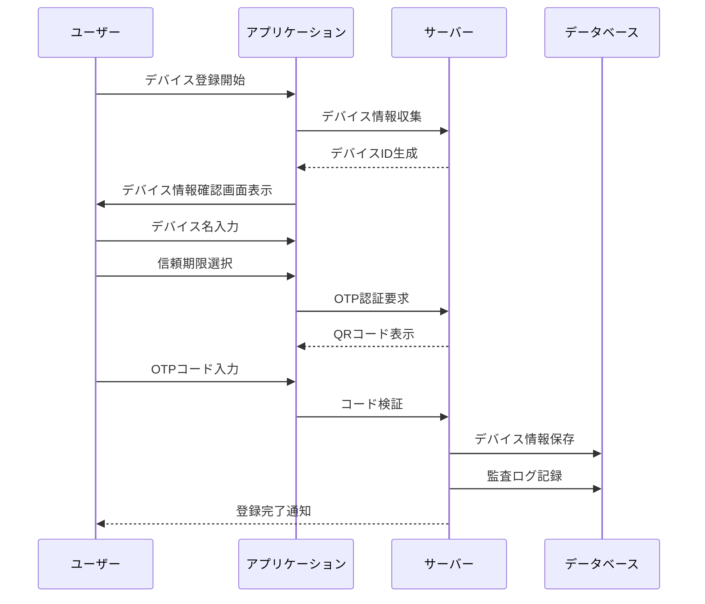

# デバイス登録フロー

## 1. デバイス登録の開始条件

### 1.1 自動開始
- 未登録デバイスから管理者画面へのアクセス時
- セキュリティレベルの高い操作の実行時
- 信頼期限切れデバイスからのアクセス時

### 1.2 手動開始
- セキュリティ設定からの登録
- デバイス管理画面からの追加
- プロフィール設定からの登録

## 2. 登録フロー

## 3. デバイス情報の収集

### 3.1 自動収集情報
- ブラウザ情報
  - ブラウザ種類
  - バージョン
  - 言語設定
- OS情報
  - OS種類
  - バージョン
  - プラットフォーム
- ネットワーク情報
  - IPアドレス
  - ユーザーエージェント

### 3.2 ユーザー入力情報
- デバイス名（カスタム）
- デバイスの用途
- 信頼期限の選択
  - 30日（デフォルト）
  - 60日
  - 90日
  - カスタム期間

## 4. セキュリティ確認

### 4.1 初期確認
- ユーザー認証状態の確認
- 権限レベルの確認
- リスク評価
  - IPアドレスの評価
  - デバイス情報の評価
  - アクセスパターンの評価

### 4.2 追加確認
- OTP認証
- セキュリティ質問（オプション）
- メール確認（オプション）

## 5. 登録完了後の処理

### 5.1 即時処理
- デバイストークンの生成
- セッション確立
- 監査ログ記録
- 登録完了通知

### 5.2 バックグラウンド処理
- セキュリティスキャン
- リスク評価の更新
- 統計情報の更新

## 6. エラーケースの処理

### 6.1 登録失敗時
1. デバイス情報収集エラー
   - 原因の特定
   - 代替情報の収集
   - ユーザーへの通知

2. OTP認証エラー
   - リトライオプションの提供
   - 代替認証方法の提案
   - エラーガイダンスの表示

3. データベースエラー
   - トランザクションのロールバック
   - エラーログの記録
   - 管理者への通知

### 6.2 リカバリー手順
1. ユーザー向け
   - エラーメッセージの表示
   - トラブルシューティングガイド
   - サポート連絡先の提供

2. システム向け
   - 自動リトライ
   - フォールバック処理
   - エラー監視アラート

## 7. 管理機能

### 7.1 デバイス管理画面
1. 表示情報
   - 登録済みデバイス一覧
   - デバイスの詳細情報
   - アクセス履歴

2. 管理機能
   - デバイス情報の編集
   - 信頼期限の変更
   - デバイスの無効化/削除

### 7.2 監視機能
1. リアルタイムモニタリング
   - アクセス状況
   - エラー発生状況
   - セキュリティアラート

2. レポート機能
   - デバイス登録統計
   - エラー統計
   - セキュリティレポート 