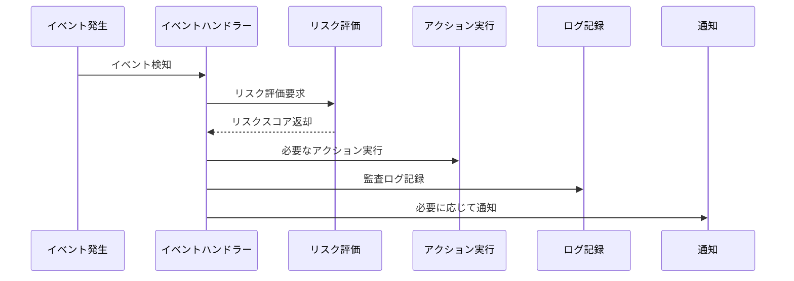

# セキュリティイベントフロー

## 1. セキュリティイベントの種類

### 1.1 認証関連イベント
- ログイン試行（成功/失敗）
- OTP認証（成功/失敗）
- パスワードリセット
- デバイス登録/削除
- セッション期限切れ

### 1.2 アクセス関連イベント
- 管理者画面アクセス
- 未知のIPからのアクセス
- 異常なアクセスパターン
- APIキーの使用

### 1.3 データ操作イベント
- 重要データの変更
- 一括データ操作
- データエクスポート
- 設定変更

## 2. イベント処理フロー

## 3. リスク評価基準

### 3.1 基本評価項目
1. ユーザー要因
   - アカウント権限レベル
   - 過去の行動パターン
   - アカウント作成からの期間

2. アクセス要因
   - IPアドレスの信頼性
   - デバイスの信頼性
   - アクセス時間帯

3. 操作要因
   - 操作の重要度
   - データの機密性
   - 操作の頻度

### 3.2 リスクスコアリング
- 低リスク（1-3）: 通常の監視
- 中リスク（4-7）: 追加認証要求
- 高リスク（8-10）: アクセスブロック

## 4. アクション定義

### 4.1 自動アクション
1. 即時アクション
   - セッション終了
   - アカウントロック
   - アクセスブロック

2. 予防アクション
   - 追加認証要求
   - アクセス制限
   - 監視強化

### 4.2 手動アクション
1. 管理者対応
   - アカウント調査
   - セキュリティレビュー
   - ポリシー見直し

2. ユーザー対応
   - パスワード変更要求
   - セキュリティ設定確認
   - 本人確認

## 5. 通知システム

### 5.1 通知先
1. システム管理者
   - 重大なセキュリティイベント
   - システム異常
   - ポリシー違反

2. ユーザー
   - アカウント関連の変更
   - セキュリティ警告
   - アクション要求

### 5.2 通知方法
1. 即時通知
   - メール
   - アプリ内通知
   - SMS（重要な場合）

2. 定期通知
   - セキュリティレポート
   - アクティビティサマリー
   - 統計情報

## 6. 監査ログ

### 6.1 ログ記録項目
1. 基本情報
   - タイムスタンプ
   - イベントID
   - 重要度

2. コンテキスト情報
   - ユーザー情報
   - デバイス情報
   - 位置情報

3. 詳細情報
   - イベントの詳細
   - リスクスコア
   - 実行されたアクション

### 6.2 ログ保持ポリシー
1. 保持期間
   - 重要イベント: 5年
   - 通常イベント: 1年
   - デバッグログ: 30日

2. アーカイブポリシー
   - 月次アーカイブ
   - 暗号化保存
   - アクセス制御

## 7. インシデント対応

### 7.1 インシデントレベル
1. レベル1（低）
   - 単発の認証失敗
   - 軽微な異常アクセス
   - 設定ミス

2. レベル2（中）
   - 複数回の認証失敗
   - 不審なアクセスパターン
   - データ操作の異常

3. レベル3（高）
   - 大規模な攻撃試行
   - 重要データの漏洩
   - システム侵害

### 7.2 対応フロー
1. 検知と評価
   - インシデント検知
   - 影響範囲の特定
   - リスク評価

2. 初期対応
   - 被害の最小化
   - 証拠の保全
   - 関係者への通知

3. 復旧と改善
   - システム復旧
   - 再発防止策の実施
   - 報告書作成 